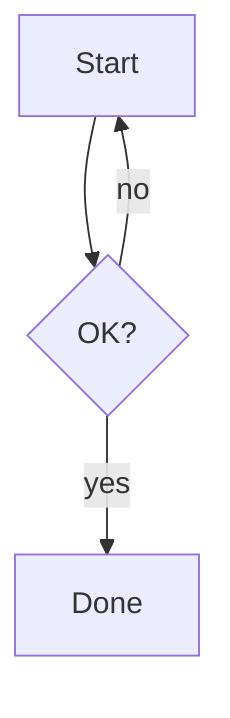

# Grimoire — guide for AI authors

Grimoire is a **runtime engine**: a single binary that reads a project (`config` +
`notes/` + `components/` + `cards/`) from disk and serves it, compiling MDX and
components on the fly. As an AI, you mostly do three things: **write notes**
(`.mdx` in `notes/`), **write cards** (`.md` in `cards/`), and **add components**
(`.tsx` in `components/`). This file is the contract.

## Golden rules

- **Notes are MDX.** Markdown + JSX. Components are **globally in scope** — NEVER
  write `import` statements inside a `.mdx` note.
- **Folders are categories.** `notes/data/sales.mdx` → category "data", slug
  `data/sales`. An `index.mdx` represents its folder.
- **Frontmatter is YAML** between `---` fences. Always quote dates: `date: "2026-06-27"`.
- **Link notes together with `[[wiki links]]`.** Backlinks and the knowledge graph
  are derived from them — you never maintain either by hand.
- The engine **hot-reloads** — run `bun run dev`, edit a note, and the page refreshes.
  **Check your work from the CLI — no browser needed:**
  - `bun run verify` — fast, browser-free: confirms every note **and card**
    compiles, its Mermaid diagrams parse, and lists every **unresolved
    `[[wiki link]]`**.
  - `bun run check` — thorough: renders every note (each locale), the graph, the
    card deck and every card in a headless browser and reports **any** runtime
    error — component exceptions, Mermaid failures, console errors (needs a
    Chromium; auto-detected or set `GRIMOIRE_CHROMIUM`).

  Both exit non-zero and print the offending note + error, so you can self-check
  after writing instead of eyeballing the browser. No rebuild needed to see edits;
  `bun run compile` only rebuilds the engine binary itself.

## Frontmatter fields

```yaml
---
title: string            # required-ish (falls back to humanized filename)
description: string       # one line, shown under the title
tags: [lowercase, list]   # filterable in the UI
date: "YYYY-MM-DD"        # quoted string
icon: 📊                  # one emoji
order: 0                  # lower sorts first within its category
draft: true               # optional — hides the note
links: [guides/authoring] # optional — extra graph edges without writing prose
aliases: [Sales report]   # optional — extra names `[[…]]` resolves to
---
```

## Built-in components (exact props)

```mdx
<Callout type="note|info|tip|success|warning|danger" title="optional">…</Callout>

<Chart type="line|bar|pie|doughnut|radar|polarArea" title="…" caption="…" height={320}
  data={{ labels: ["Q1","Q2"], datasets: [{ label: "2026", data: [12, 19] }] }} />

<DataTable searchable pageSize={10} caption="…"
  data={[{ name: "Ada", score: 99 }]}
  columns={["name","score"]} />   {/* columns optional; inferred if omitted */}

<Tabs><Tab label="bun">…</Tab><Tab label="npm">…</Tab></Tabs>

<Steps><Step title="Install">…</Step><Step title="Run">…</Step></Steps>

<CardGrid columns={3}>
  <Card title="Guide" icon="📘" note="guides/authoring">Open the guide</Card>
</CardGrid>

<Badge color="#7c3aed">new</Badge>   <Kbd>Ctrl</Kbd>

<Graph note="guides/authoring" depth={1} height={320} />   {/* local knowledge graph */}
<Graph card="engine-boot" />                                {/* …around a card */}
<Backlinks />   <Links />                                   {/* of the current note */}
<Backlinks of="engine-boot" />

<Cards tag="engine" columns={2} />            {/* card grid, filtered */}
<Cards deck="engine" limit={4} />
<Cards ids="engine-boot,card-format" expand /> {/* render the card bodies inline */}
```

### Diagrams (Mermaid)

Write a fenced `mermaid` block — it renders as a diagram (flowchart, sequence,
state, class, ER, gantt, mindmap…). This is the preferred way:

````mdx

````

Or the component form when you need it inline: `<Mermaid chart={`sequenceDiagram
  A->>B: hi`} />`. The mermaid library is loaded lazily (only on pages that use
it) and re-themes with dark mode automatically. Mermaid uses **auto-layout** —
great for structured flows; for very large/dense graphs, split into subgraphs or
multiple diagrams.

## Wiki links, backlinks & the graph

Write `[[…]]` in any note or card. Everything else — backlinks, the `#/graph`
page, the Connections panel under each note — is derived from these.

```mdx
See [[guides/authoring]].                            {/* by id */}
See [[authoring]].                                   {/* by unique file name */}
See [[Authoring Notes]].                             {/* by title */}
Start with [[guides/getting-started|the quick start]].   {/* custom text */}
Jump to [[guides/authoring#frontmatter|frontmatter]].     {/* heading anchor */}
Disambiguate with [[card:engine-boot]] / [[note:engine-boot]].
```

- Resolution order: explicit `note:`/`card:` prefix → exact id → **unique**
  basename/title/alias. **Ambiguity resolves to nothing** — if two notes share a
  name, the link is reported broken instead of guessed.
- Links inside fenced code blocks and `` `inline code` `` are ignored, so
  documenting the syntax never creates an edge.
- An unresolved link renders with a wavy underline; `bun run verify` lists every
  one of them. Fix them or create the target.

## Card notes (`cards/`)

Cards are the small end of the scale: one idea, one name, plain text. One file is
one **deck**; each card is separated by its own YAML block.

```md title="cards/engine.md"
---
title: Boot sequence
id: engine-boot          # optional — defaults to a slug of the title
tags: [engine, runtime]
icon: 🚀                 # optional
links: [guides/getting-started]   # optional, same as a note's `links`
---

Body markdown, with [[wiki links]] like anywhere else.

---
title: CSS pipeline
---

The next card.
```

- A `---` only starts a card when it sits on its own line **after a blank line**,
  closes within a few lines, parses as YAML, and declares a `title` or `id`.
  Everything else stays body text — use `***` for a rule inside a card body.
- `cards/engine.zh.md` is the Chinese translation of `cards/engine.md`: keep the
  same `id`s so the two stay linked.
- Cards are first-class graph nodes: notes link to them, they link back, and they
  show up in the graph as hollow circles. Browse them at `#/cards`.
- Reach for a card when the knowledge is a *claim* worth naming and re-using;
  reach for a note when it's a *document* with sections and an argument.
- Scaffold one with `bun run new --card <deck> --title "…" [--tags a,b]`.

## Theming

**Everything lives in `config.ts` and takes effect on save** — no engine rebuild,
ever. Readers can layer their own choices on top from the palette button.

```ts
theme: {
  preset: "grimoire",     // a built-in, one of `presets` below, or an inline palette
  accent: "violet",       // an accent name, or any hex ("#0ea5e9")
  mode: "system",         // light | dark | system
  radius: 1,              // 0 (sharp) … 2 (very round)
  picker: true,           // let readers pick their own theme

  // Typography — three scopes, each with a typeface and a size multiplier.
  font: "sans",           // reading text (.prose)      sans | serif | mono
  uiFont: "sans",         // navigation chrome          — defaults to `font`
  categoryFont: "mono",   // category labels + crumbs   — defaults to `uiFont`
  fontSize: 1,            // 0.75 … 1.6, reading text only
  uiFontSize: 1,          // 0.75 … 1.6, navigation only
  categoryFontSize: 1,    // 0.75 … 1.6, category labels only
  density: "comfortable", // compact | comfortable | spacious — scales the whole UI
}
```

**Typography scopes.** `font` is the reading text; `uiFont` is the sidebar and top
bar; `categoryFont` is the uppercase category labels, sidebar section headings and
breadcrumbs. Each falls back to the one above it, so setting `font` alone keeps the
site consistent, and overriding just `categoryFont` gives you a display face for
labels without touching anything else.

Built-in presets: `grimoire` `slate` `paper` `nord` `carbon` `sakura`.

### Typography scopes

`font` is the reading text; `uiFont` is the sidebar and top bar; `categoryFont` is
the uppercase category labels, sidebar section headings and breadcrumbs. Each falls
back to the one above it, so setting `font` alone keeps the site consistent, and
overriding just `categoryFont` gives you a display face for labels without touching
anything else.

In markup they're two classes — reuse them if you add chrome of your own:
`grimoire-nav` (navigation typeface + `--ui-scale`) and `grimoire-category`
(category typeface, uppercase, `--category-scale`). Sizes inside `.grimoire-nav`
are `em`-based so `uiFontSize` reaches all of them.

### Defining your own palette

A palette is the eleven greys everything is drawn from. Add one to `theme.presets`
and it shows up in the picker next to the built-ins:

```ts
theme: {
  preset: "moss",
  presets: [
    {
      id: "moss",
      label: "Moss",
      extends: "paper",              // inherit anything you don't set
      accent: "#4d7c0f",
      white: "oklch(99% 0.008 150)", // optional: what `bg-white` becomes
      neutral: [                     // required: 11 colours, 50 → 950, light → dark
        "oklch(97.6% 0.009 150)", "oklch(95.6% 0.012 150)", "oklch(91.4% 0.016 148)",
        "oklch(86% 0.019 146)",   "oklch(70.4% 0.025 144)", "oklch(55.2% 0.027 142)",
        "oklch(44.4% 0.025 140)", "oklch(37.2% 0.023 138)", "oklch(27% 0.019 136)",
        "oklch(21.4% 0.016 134)", "oklch(15% 0.013 132)",
      ],
    },
  ],
}
```

- **All 11 shades or nothing.** A short or malformed ramp is rejected outright and
  logged to the terminal — it will not half-apply.
- `neutral` also accepts an object keyed by shade (`{ "50": "…", "100": "…" }`).
- Give a palette the **id of a built-in** to re-tune that built-in in place:
  `{ id: "paper", accent: "#111" }` keeps Paper's ramp and changes only its accent.
- One ramp serves both modes — light uses 50–200, dark uses 800–950 via `dark:`.
- For a one-off you can skip `presets` and write the palette straight into
  `preset: { … }`.

### Why it's this small

Tailwind v4 utilities read theme variables (`.bg-neutral-50 { background-color:
var(--color-neutral-50) }`), so a preset is just `--color-neutral-*`,
`--color-white`, `--radius-*`, `--font-body` and `--accent` re-declared on `:root`.

So **style your own components with `neutral` utilities and `var(--accent)`, never
hard-coded hex colours**, and they inherit every palette — including ones the
author writes later — for free.

`density` scales the root font size (and therefore the whole rem-based layout);
`fontSize` / `uiFontSize` / `categoryFontSize` scale their own scope via
`--prose-size`, `--ui-scale` and `--category-scale`. All are emitted as ratios,
never pixels, so a reader's own browser font-size setting is preserved.

## Custom components shipped in `components/`

```mdx
<StatCard label="Revenue" value="$1.2M" delta="+12%" trend="up|down|flat" />

<Timeline>
  <TimelineItem title="Founded" date="2024" icon="✨">First commit.</TimelineItem>
</Timeline>

<ProgressBar label="Coverage" value={72} max={100} color="#7c3aed" />

<Quiz question="2 + 2 = ?" options={["3","4","5"]} answer={1}
  explanation="Basic arithmetic." />
```

## Markdown

GitHub-flavoured: tables, task lists (`- [x]`), blockquotes, `**bold**`, links.
**Always put a language on fenced code blocks** (` ```ts `, ` ```python `, ` ```bash `)
so they get syntax-highlighted at build time.

Do **not** start a note with an `# H1` — the title from frontmatter is rendered for
you. Begin with a short intro paragraph, then use `##`/`###`.

### Code viewer metadata

Add metadata after the language to enrich a code block:

````md
```ts title="src/server.ts" showLineNumbers {2,4-6}
…code…
```
````

- `title="file.ts"` → filename header + language badge
- `showLineNumbers` → line-number gutter
- `{2,4-6}` → highlight lines 2 and 4–6

## Translations

To add a Chinese (or other-locale) version of a note, create a sibling file with a
language suffix matching a `config.ts` locale code:

```
notes/guides/getting-started.mdx       # English (default)
notes/guides/getting-started.zh.mdx    # 中文 — same base slug
```

Both share the slug `guides/getting-started`, so the language switcher swaps between
them in place. When translating: translate prose, headings, frontmatter
`title`/`description`/`tags`, and human-readable prop values (chart labels, callout
titles…), but **keep component/prop names, data shapes, numbers and code-fence meta
unchanged**. Don't add a `lang` field — the filename suffix is authoritative.

## Adding a component

Create `components/MyThing.tsx`. It's a **Preact** component (not React):

```tsx
import { useState } from "preact/hooks";
import type { ComponentChildren } from "preact";

export function MyThing({ children }: { children?: ComponentChildren }) {
  return <div class="rounded-2xl border border-neutral-200 p-4 dark:border-neutral-800">{children}</div>;
}
```

- Every **named export** is auto-registered (the file's PascalCase name maps to a
  default export, if any). Components are bundled per-file at runtime; import
  `preact`, `preact/hooks`, `@mdx-js/preact` freely — they resolve to the engine.
- Don't touch `window`/`document`/`localStorage` during render — only inside
  `useEffect` or event handlers.
- Style with Tailwind; use `var(--accent)` (e.g. `text-[var(--accent)]`) for the
  theme color; support light **and** dark mode (`dark:` variants). The server scans
  your files for class names, so utilities you use are always generated.

## Where things are

- `config.ts` / `config.json` — site title, theme, category order.
- `notes/` — your notes (this is where most work happens).
- `cards/` — your card decks.
- `components/` — your components.
- `src/` — the engine (`serve.ts`, `engine.ts`, `runtime/`, `client/`). Touch only
  to extend the framework itself; rebuild with `bun run compile`.
  - `runtime/theme.ts` — presets → CSS custom properties.
  - `runtime/links.ts` — `[[…]]` parsing, resolution, graph + backlinks.
  - `runtime/cards.ts` — deck parsing and card indexing.
- `tests/` — `bun test` (unit + Given/When/Then specs under `tests/features/`),
  `bun run test:e2e` (browser).
