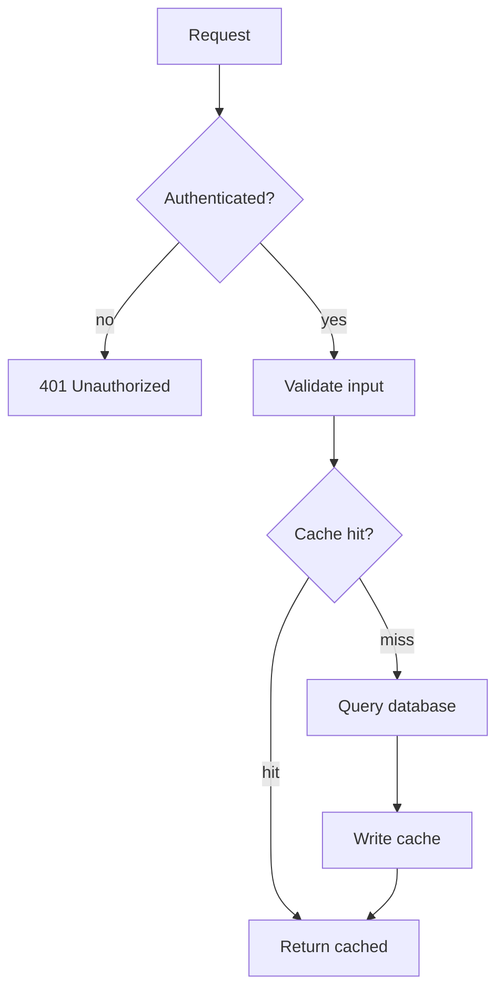
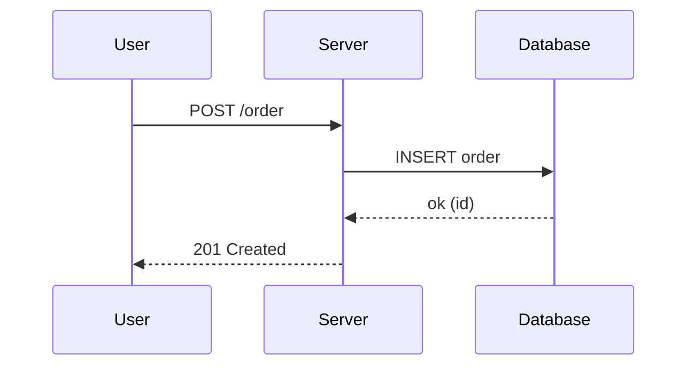
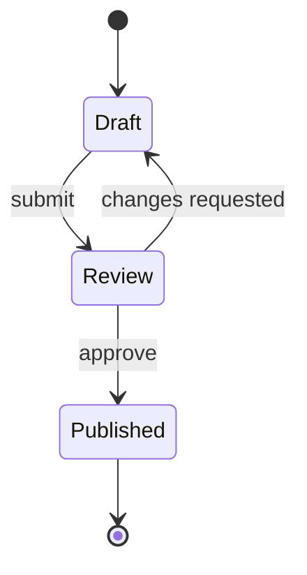
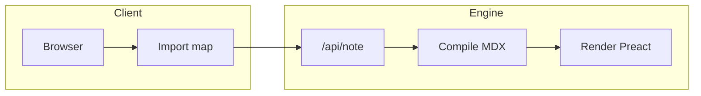

Write a fenced `mermaid` block and it renders as a diagram — no setup. The
mermaid library is loaded lazily (only on pages that use it) and re-themes with
dark mode automatically. Try toggling the theme while viewing this page.

## Flowchart

## Sequence

## State

## Grouping with subgraphs

For structured flows, group related nodes — this keeps larger diagrams readable.

## Component form

When you need it inline (e.g. building the source dynamically), use the
component directly:

<Mermaid chart={`mindmap
  root((Grimoire))
    Notes
      MDX
      Frontmatter
    Components
      Built-in
      Custom
    Diagrams
      Mermaid`} />

<Callout type="tip" title="Complex diagrams">
  Mermaid uses automatic layout. For very large or dense graphs, split into
  subgraphs or several linked diagrams rather than one giant chart.
</Callout>
