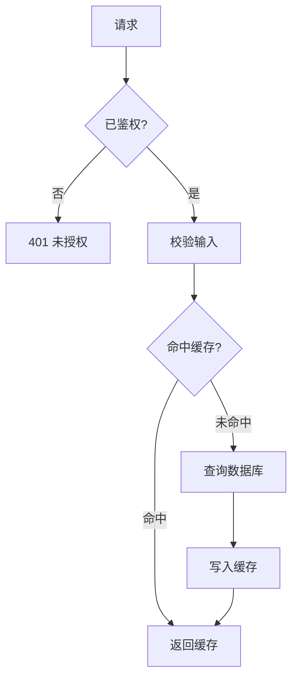
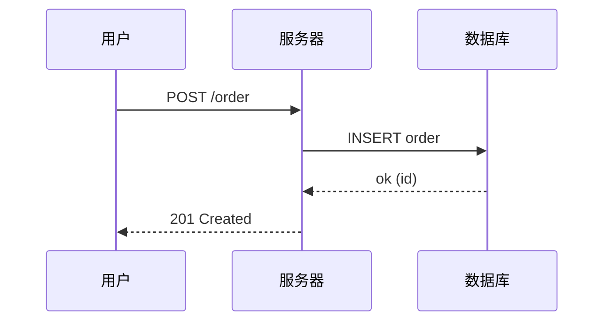
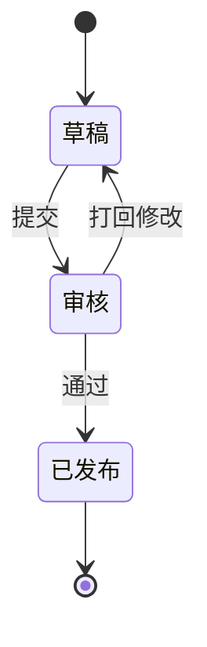
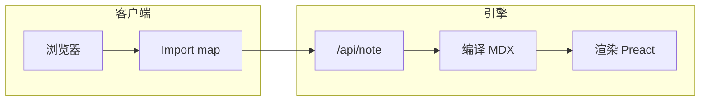

写一个 `mermaid` 代码块就能渲染成图 —— 零配置。mermaid 库按需懒加载(只在用到的
页面加载),并跟随深色模式自动切换主题。你可以在看这一页时切换主题试试。

## 流程图

## 时序图

## 状态图

## 用子图分组

结构复杂的流程,把相关节点分组 —— 大图也能保持清晰。

## 组件写法

需要内联(比如动态拼接源码)时,直接用组件:

<Mermaid chart={`mindmap
  root((Grimoire))
    笔记
      MDX
      Frontmatter
    组件
      内置
      自定义
    图表
      Mermaid`} />

<Callout type="tip" title="复杂的图">
  Mermaid 用自动布局。图非常大或非常密时,拆成子图或多张互相链接的图,而不是硬塞进
  一张巨图。
</Callout>
